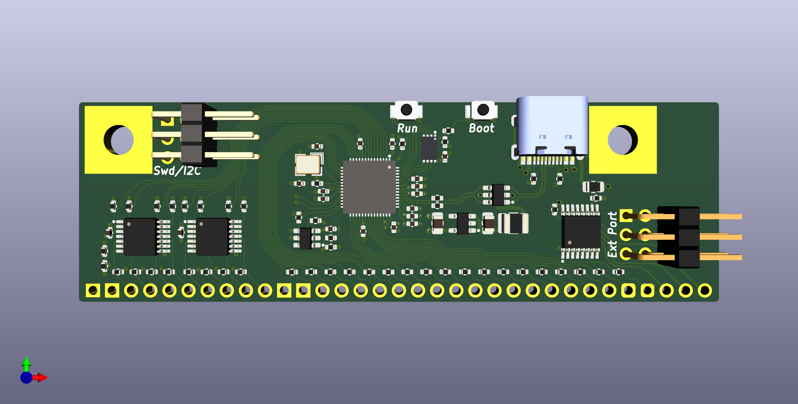
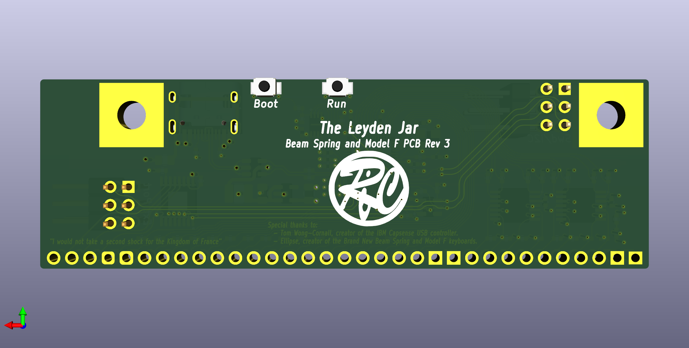
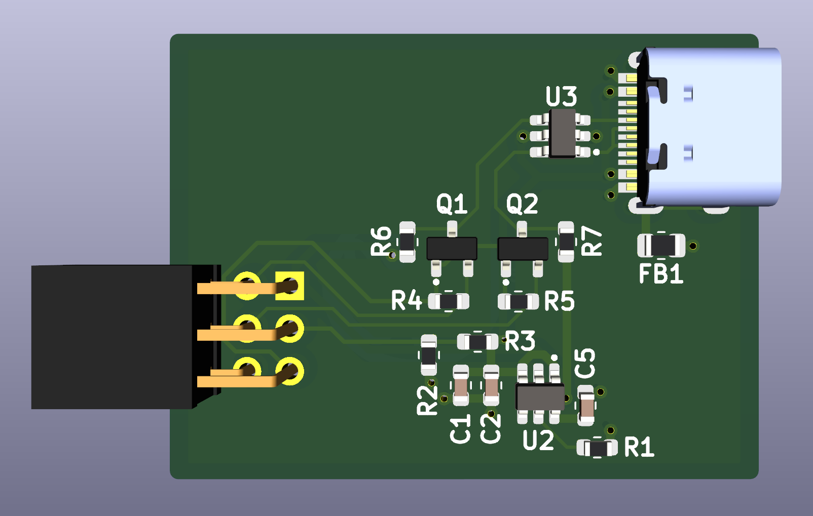
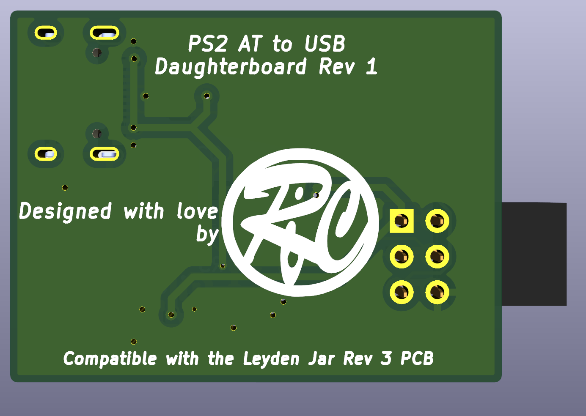

# The Leyden Jar

The [Leyden Jar](https://en.wikipedia.org/wiki/Leyden_jar) is a modernized controller PCB for the Brand New Model F and Beam Spring keyboards.
The name is taken from the first ever (crude) capacitor ever invented.

Please have a look at the Keebtalk [here](https://www.keebtalk.com/t/the-leyden-jar-a-tentative-pcb-replacement-for-the-brand-new-model-f-keyboards/17489/1) for more details on the development process.

## How the project started

It was in April 2022 when Ellipse of Model F Labs asked in Geekhack and Deskthority forums if someone was up to make a new RP2040 based controller PCB that could replace the Xwhatsit controller that it was using in it's Brand New Model F and Beam Spring keyboards.  

I never worked on capacitive sensing technologies and never used RP2040 MCUs before. 
Also the amound of work looked quite big as a both a new PCB design and firmware code had to be made from the ground up.
But this is something that crossed my mind for quite a long time before and was excited to take this challenge.

The Leyden Jar PCB is the result of one year of work trying to fullfill this little dream of mine!

## Project status

Several revisions have been designed.

Revision 1 has been used to do a first battle test of the design on real boards.
My own Brand New Model F77 keyboard has first been used to validate the PCB design and the firmware.  
Later some controllers have been sent to Ellipse for further testing/development on one of it's Brand New Beam Spring Full Size Round 2 keyboards. 

Newer revisions modifications are rather minor. But while revision 1 was already working great I wanted to tidy up things a bit and also Ellipse had a few requests that were nice to have implemented.  

### Note
At the time of this writing the firmware code has been adapted from revision 1 without any validation and the revision 2 PCB is still not manufactured and tested.

## Licence

In order to give tribute to Tom Wong-Cornall, the inventor of the IBM Capsense USB keyboard controller, with the exceptions noted below, everything is provided with the same GPLv3 licence he used at the time.

### Exception for the firmware code

Everything inside 'firmware' directory is source code marked under the GPLv2 licence, this is because it is already available in another forked repository of QMK VIAL under this licence.  
I just put it here to centralize information and ease your life.  
In the case you plan to reuse this source code in your own projects, either as is or with modifications, the GPLv2 licence will apply.

### Exception for some 3D models

Two 3D model files, taken from SnapEDA website, that are using the [Creative Commons Attribution-ShareAlike 4.0 International License (CC BY-SA)](https://creativecommons.org/licenses/by-sa/4.0/)  with the [Design Exception 1.0 licence](https://www.snapeda.com/about/FAQ/#designexception):
* B3U-3000P--3DModel-STEP-56544.STEP
* TYPE-C-31-M-12--3DModel-STEP-56544.STEP

## Use at your own risks

This PCB design and software are provided for free and I am not paid for this work.  
Although it worked for my Model F77 and one of Ellipse's Beam Spring keyboard it may not for you or even worse can render your keyboard unusable.   
By using this material you agree that I will not be liable for any problems you may have.

## Features

### Hardware

* 4 layers PCB designed using Kicad 6.x.
* RP2040 MCU.
* 2MB external QSPI XIP flash memory.
* USB C receptacle.
* ESD protection of both VBUS and D+/D- lines,
* Overcurrent protection with a resettable fuse.
* EMI shielding using a ferrite bead.
* All matrix IO pins rugged with 1K current limit resistors.
* Status leds driven by an I2C IO expander chip.
* 3X2 header for:
    * Solenoid driver.
    * Future PS2 AT daugherboard.
* 3x2 header for:   
    * SWD debugging.
    * External I2C connection. 

### Software

* QMK VIAL firmware (VIA compatible by providing vial.json file).
* Solenoid support.
* 3 QMK layers support (can be much more if user want, we have little to no memory constraints).
* Custom USB raw HID protocol support for basic monitoring/debugging using an external tool. 
* Early support for following keyboards:
    * Brand New Model F77 (tested on my own F77).
    * Brand New Model F62 (untested).
    * Brand New Beam Spring Full Size Round 2 (tested by Ellipse).
    * Brand New Beam Spring SSK (untested, matrix definition may be totally wrong).

## Repository content

### pcb/leyden_jar_controller
Contains Kicad 6.x project files.

### production_files/leyden_jar_controller/bom
Contains an HTML interactive BOM, very handy for people wanting to solder the components themselves.

### production_files/leyden_jar_controller/jlcpcb
Contains everything needed to manufacture and assemble the controller at JLCPCB.  
The 4 buttons and 2 3x2 headers are not listed in the BOM.

### images 
Images content, mostly for this repository documentation.

### firmware

QMK VIAL source code for the controller.  
Copy the content of this directory in the 'keyboards' directory of your qmk-vial repository.  

This is a VIAL targetted firmware; although it can also work with VIA it will have limited features like no solenoid configuration support and you will be forced to upload the vial.json file each time the VIA application is opened.  

The 'default' keymap is not configured at all, please only use the 'vial' keymap. 
## Revision History

### Revision 1

First version, not available in this repository.

### Revision 2

* Added support for 2 additional columns.
* Now uses only one I2C bus.
* Removed external I2C EEPROM chip (keyboard state is saved in QSPI flash memory). 
* Solenoid now driven by RP2040 IO pins (was done through I2C IO expander before).
* Added early future support to PS/2 daughterboard using existing solenoid connector.
* Routing improvements.
### Revision 3

* Last free pin of the solenoid connector now outputs 3.3V.
* Top left connector rework:
    * Now a 3X2 connector.
    * Left 3 pins are ground and SWD pins.
    * Right 3 pins are 3.3V and I2C pins (to drive potential future I2C devices). 
* Run/Bootsel buttons rework:
    * added 2 additional buttoms on the bottom of the PCB.
    * footprints reworked to easily short pads with a flat screwdriver.
    * buttons not populated by default.
    * B3U-1000P variants (top press version) listed in project.
    * still comatible with B3U-3000P variants (side press version).
* Routing improvements.
## Comparison with existing controllers

To my knowledge all existing controllers we see nowadays in our Model F or Beam Spring keyboards are derivatives of 2014 Tom Wong-Cornall work for the Xwhatsit controller PCB.  
As a result they share the same capacitive detection principle and the Leyden Jar controller is no different in that regard.
Tom Wong-Cornall explained it in great details in this [link](https://static.wongcornall.com/ibm-capsense-usb-web/ibm-capsense-usb.html).

The first obvious difference is the use of a modern RP2040 MCU instead of the old good Atmega 32U2.  
It is a cheap MCU and still widely available during the current component shortage period.  
But it is the features that it was giving that resulted in a significantly different way to implement the well known capacitive detection principle.

1. PIO feature  
The timing of pulsing the matrix colums and reading the rows are crutial to have consistent/reliable results.  
On Xwhatsit accurate timings are ensured by writing all this critical code part in Atmega assembler.  
With the Leyden Jar PIO is used instead with no CPU intervention during the whole matrix scanning process.  
We can safely manage much tighter timings using PIO than using the CPU, this allowed me to have significantly more aggressive/shorter timings and reduce the time it takes to make a full matrix scan: it takes 40us to strobe a single column for a total of 640us to scan 16 columns.  

2. Available memory  
There is 264KB of RAM available on RP2040 vs 1KB on Atmega32U2.  
External flash is usually 2MB vs 32KB.  
No more need to count how many memory bytes you have left when you're coding the firmware, you'll always have memory available when you'll need it; this makes firmware programming significantly easier and opens up new possibilities.

3. Available GPIOs  
There are 30 available on RP2040 vs 22 on Atmega32U2.  
As a result we have enough IO pins to directly drive the matrix scanning system, removing the need of the IO expander chips we find in existing controllers.  
The Leyden Jar can drive up to 18 columns instead of 16 on current controllers, making big keyboards designs like F122 less of a challenge.  
All 30 GPIO pins are used in this design, nothing is lost ;)

4. Working voltage  
It is 3.3V on RP2040 vs 5V on Atmega32U2.  
Old controllers like Atmegas were very often working at 5V to give them good noise immunity.  
On moderm ARM controllers working at lower voltages, noise becomes a problem that needs to be taken care off. If you add the fact that pulsing columns at 3.3V will give smaller voltage spikes than doing that with 5V, minimizing noise is even more important for this particular case.  
This is why the Leyden Jar PCB is a 4 layers design, with all critical traces all on the top layer with no vias, a solid ground place on the layer just below and the last 2 layers containing the power planes and non critical traces.  
Traces are also curved. While it aestetically pleasing it is also done to limit reflection problems when pulsing the columns (curved traces are often used in high frequency applications PCBs). 

5. I2C usage  
This protocol is used instead of SPI to minimize IO pin usage, only 2 GPIO pins are used to drive both a DAC chip (for the voltage reference) and a IO expander chip (mostly used for driving the 3 LEDs).

## PS2 AT to USB daughterboard PCB

This new sister project is a daughterboard that connects into the IO expander of the Leyden Jar controller.  
This extension aims in the future to provide PS2 AT compatibility.  
As the same IO expander port is also used for the solenoid connector you will not be able to use both solenoid and PS2 AT extensions at the same time.

### pcb/ps2_at_daughterboard
Contains Kicad 6.x project files.
### production_files/ps2_at_daughterboard
Contains everything needed to manufacture and assemble the board at JLCPCB.  

**WARNING!!!**  
This project is in it's very early stage.  
We have yet to manufacture PCBs, test them and write software for them.

## Special thanks

If people as still able nowadays to type on a Model F or Beam Spring keyboard, either old good or brand new, it is thanks to the hard work and dedication of several people of this great keyboard community.

### Tom Wong-Cornall
The first who designed a controller replacement for the IBM Model F and Beam Spring keyboards, the IBM capsense USB controller (Xwhatsit). Most if not all existing controllers are based on it's original design.  

### Ellipse of Model F Labs
He manufactured the Brand New Model F and Beam Spring keyboards, it is always a great pleasure to type on my Model F77 board.

### Wcass
He made many variants of the original XWhatsit controller and a lot of switch plate PCB designs for Ellipse.

### Pandrew
He also made variants of the XWhatsit and Solenoid controllers and worked on the QMK/VIA port of original Tom Wong-Cornall firmware, improved it and maintained it for all those years.

For all those people and many I forgot to mention, **thank you!**

